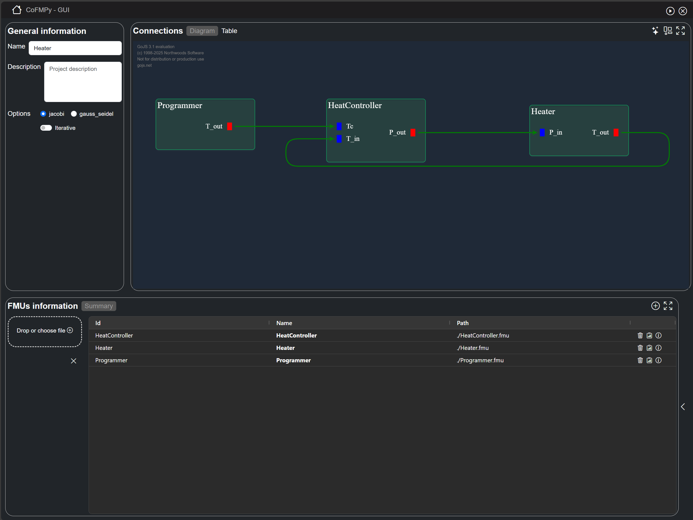

# CoFmuPy-GUI

User interface for **CoFmuPy** library.

This repository contains only user interface code. It produces versionned artifacts consumed by Python backend (CoFmuPy library).


**Web App overview**




## 🎯 User interface role

- Provide web user interface
- Communicate with backend using http and WebSocket API

👉 This user interface can be served by backend flask, see [CoFmuPy library](https://github.com/IRT-Saint-Exupery/CoFmuPy) documentation.


## 🧩 API consistency

Compatibility with backend is made by file *api-compatibility.json*, here is an example :

```json
{
  "min": "1.0",
  "max": "2.x"
}
```

---

## 🏗️ Local development

### Prerequisite

- Node.js ≥ 18
- Angular CLI

### Content :

Composed of 2 sub-directories :

* **cofmupy-gui-app**, for the application itself
* **node-server**, for the server that manage application, only useful for standalone application.

### Installation and Start (development/debug mode)

```bash
# Go to application directory
cd ./cofmupy-gui-app

# Installation
npm install

# Start application, development mode
ng serve
```

### Build and Start (end-user mode)
**1. Build cofmupy-gui application**

Open a terminal at root directory and execute following commands

```bash
# Navigate to application directory
cd ./data-manager-gui-app

# Update libraries
npm install

# Run build command
ng build
```

This will compile your project and store the build artifacts in the `/cofmupy-gui-app/dist` directory.

**2. Build node server**

```bash
# Navigate to node server directory
cd ../node-server

# Update libraries
npm install

# Run build command
parcel build app.js

```
This will compile node server and store the build artifacts in the `/node-server/dist` directory.

**3. Assemble to make a standalone package**

Concatene files contained into `/cofmupy-gui-app/dist/browser`, `./node-server/dist/app.js` and assets files. The distribution should be composed of following files :
* Application :
  * **assets** directory : resources directory
  * **app.js** : node server entry point
  * **index.html** : User interface entry point
  * **main-*.js** : Application main scripts and views
  * **polyfills-*.js** : Application complement scripts and views
  * **style-*.css** : Application styles
* Starter scripts :
  * **Start_CoFmuPy_Gui.bat** : Script file to start application (Windows)
  * **Start_CoFmuPy_Gui.sh** : Script file to start application (Linux)

**4. Start application**

To start generated application, execute *Start_CoFmuPy-Gui* batch file and follow instructions.

## 📦 Releases and artifacts

Releases and artifacts are automatically generated via GitHub Actions.

Artifacts content, generated for each push on main branch :
- `cofmupy-gui_standalone.zip` : zip file containing standalone application with launcher batch file, node server and CoFmuPy-gui application.

Releases content, generated for each added tag with containing text `v*` :
- `CoFmuPy-gui-dist.zip` : zip file with generated application, can be download by CoFmuPy library to serve it in production mode.
- `metadata-dist.json` : metadata with application caracteristics, including compatibility version with backend API

## ✒️ Contributing

Feel free to propose your ideas or come and contribute with us on the CoFmuPy library!

## 📄 Licence

The package is released under the [2-Clause BSD License](https://opensource.org/license/bsd-2-clause).
